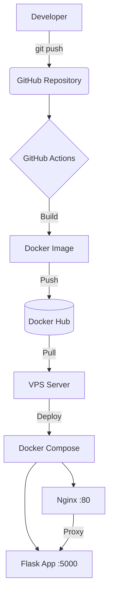

# Auto-Deploy Flask App with CI/CD

## About the Project

Pet project to demonstrate **DevOps Engineer** skills. Full CI/CD cycle implemented:
- Automatic Docker image build
- Publication to Docker Hub
- Deployment to VPS via SSH

## Architecture

## Tech Stack

| Category | Tools |
|----------|-------|
| **Language** | Python 3.11, Flask |
| **Containerization** | Docker, Docker Compose |
| **CI/CD** | GitHub Actions |
| **Web Server** | Nginx (reverse proxy) |
| **Infrastructure** | Ubuntu 22.04, VPS |
| **Image Registry** | Docker Hub |