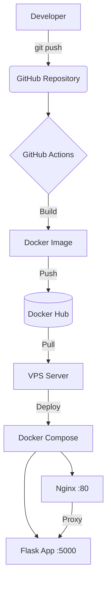

# Auto-Deploy Flask App with CI/CD

## О проекте

Пет-проект для демонстрации навыков **DevOps Engineer**. Реализован полный цикл CI/CD:
- Автоматическая сборка Docker-образа
- Публикация в Docker Hub
- Деплой на VPS по SSH

---

## Архитектура

---

## Стек технологий

| Категория | Инструменты |
|-----------|-------------|
| **Язык** | Python 3.11, Flask |
| **Контейнеризация** | Docker, Docker Compose |
| **CI/CD** | GitHub Actions |
| **Веб-сервер** | Nginx (reverse proxy) |
| **Инфраструктура** | Ubuntu 22.04, VPS |
| **Реестр образов** | Docker Hub |